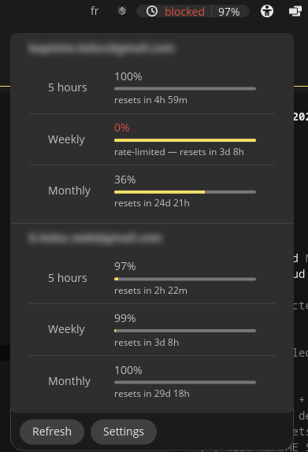
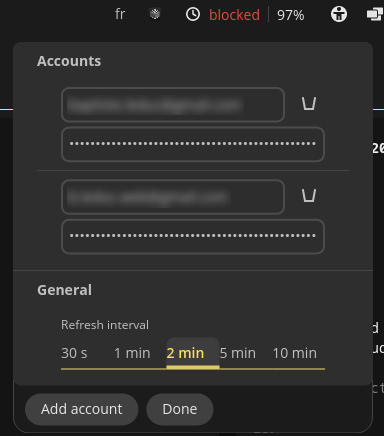

# opencode-go-statusbar

A [COSMIC desktop](https://github.com/pop-os/cosmic-epoch) panel applet that shows the
remaining usage quota of one or more **OpenCode Go** accounts.

## Features

- **Panel button**: the applet icon followed by one label per configured account
  - the label shows the **worst remaining %** across the account's three windows
    (5-hour, weekly, monthly) — the true "time until I'm blocked"
  - turns **orange** when fewer than 20% remain, and shows a red **`blocked`**
    label as soon as any window is exhausted or rate-limited
- **Popup**: one section per account with the **5 hours / Weekly / Monthly**
  quota bars (remaining %, reset countdown, `rate-limited` badge) and per-account
  error reporting (invalid key, missing subscription, network failure)
- **Settings** (footer button in the popup): add / remove accounts (name + API key)
  and pick a refresh interval (30 s – 10 min)
- Configuration is persisted with `cosmic-config`
  (`~/.config/dev.korbeil.opencode-go-statusbar/`) and hot-reloaded when the file
  changes on disk

## Screenshots

The applet button in the panel (one label per account, `|`-separated) with the
quota popup open — bars show the used quota, numbers what remains:



The settings popup (accounts and refresh interval):



## The OpenCode Go API

The applet queries OpenCode's first-party (but undocumented) usage endpoint:

```
GET https://opencode.ai/zen/go/v1/usage
Authorization: Bearer <api key>
```

which returns, per window, the percent of the budget already used, a
`ok | rate-limited` status, and an ISO-8601 `resetsAt` timestamp:

```json
{ "usage": {
    "rolling":  { "status": "ok", "percent": 0,   "resetsAt": "2026-09-03T18:41:15Z" },
    "weekly":   { "status": "ok", "percent": 64,  "resetsAt": "2026-09-07T00:00:00Z" },
    "monthly":  { "status": "ok", "percent": 12,  "resetsAt": "2026-09-28T12:41:54Z" }
} }
```

Go plan limits: **$12 per 5 hours, $30 per week, $60 per month**.
An API key comes with an [OpenCode Go](https://opencode.ai/docs/go/) subscription —
sign in at [opencode.ai/auth](https://opencode.ai/auth) and copy the key.
The key is stored locally in the applet's config file (plaintext, user-scoped,
standard for COSMIC applet configs).

## Building

Requires Rust ≥ 1.85 (edition 2024) and the usual COSMIC build dependencies
(`build-essential`, `libxkbcommon-dev`, `libwayland-dev`, `cmake` for rustls).

```sh
just            # build-release (default)
just check      # clippy with pedantic lints
just test       # unit tests (no network needed)
just run        # run the applet standalone for testing
```

## Installing

System-wide:

```sh
sudo just install
```

or into your home directory (no root needed):

```sh
just install-user
```

Then add the applet to the panel: **COSMIC Settings → Panel → Applets → Add →
"OpenCode Go Statusbar"** (a re-login may be needed for the panel to discover a
freshly installed applet).

Uninstall with `sudo just uninstall` / `just uninstall-user`.

## Usage

1. Click the applet icon in the panel to open the popup.
2. Click **Settings**, then **Add account**.
3. Enter a display name and your OpenCode Go API key.
4. Quotas refresh on the configured interval, when the popup opens, and via the
   **Refresh** button.

## License

MPL-2.0
